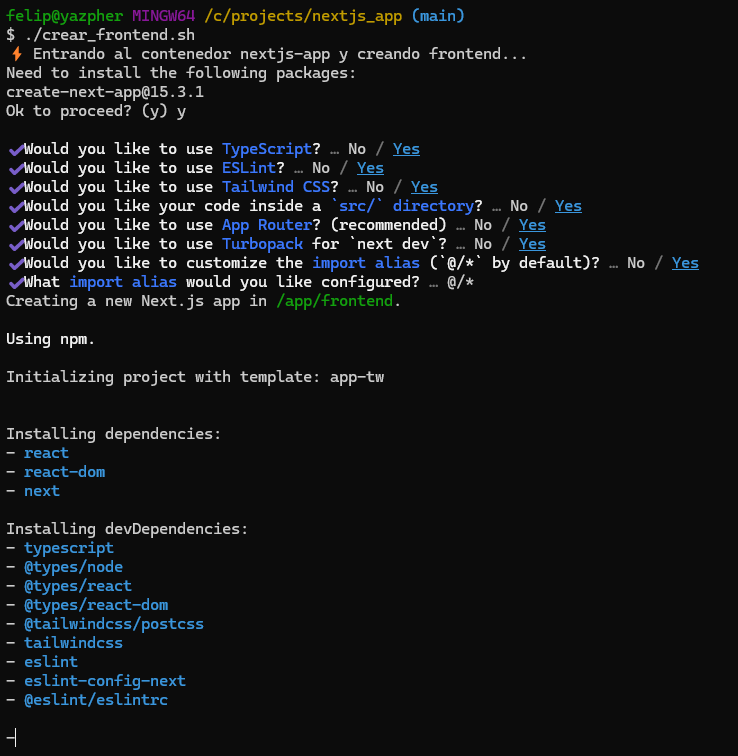

# Manual de instalacion 

# Requisitos: 
1. Tener instalado Docker en el sistema operativo
2. Tener instalado git -> Para usar la gitbash

# Pasos para la instalacion
## Desde la terminal de Git bash realizar lo siguiente
1. Descargar el repositorio 
```
    git clone git@github.com:Yazpherr/nextjs_app.git 
```
o 
```
    git clone https://github.com/Yazpherr/nextjs_app.git
```

2. Correr el siguente comando para construir el contenedor 

```
    docker compose build --no-cache
```
3. Correr el siguiente comando para instalar desde dentro del contenedor el proyecto 
con nombre frontend.
```
    ./crear_frontend.sh
```
En este paso nextjs hara una serie de preguntas para la configuracion correcta, en la imagen se muestra un ejemplo de como seria una instalacion, pero el desarrollador debe seleccionar las que mas se adapten a su proyecto.




4. Levantar el contendor 
```
    docker compose up
```

#### Nota: Cuando se levante el contenedor se debe de esperar de 10 a 15 segundos la primera vez, por los siguientes motivos: 

1. Turbopack (o Webpack) necesita analizar y compilar todo tu proyecto la primera vez.
2. Estás corriendo dentro de un contenedor, lo que agrega un pequeño "delay" en el filesystem comparado a tu máquina nativa.
3. Si es la primera vez que corres el contenedor, instala dependencias y genera caches de paquetes.
4. Una vez que se crea el primer cache, después los próximos levantamientos serán MUCHO más rápidos.
